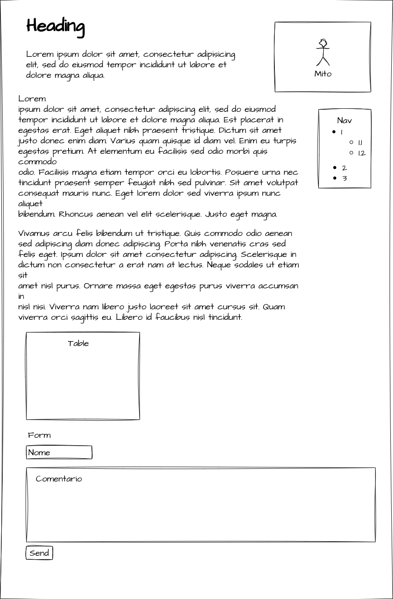
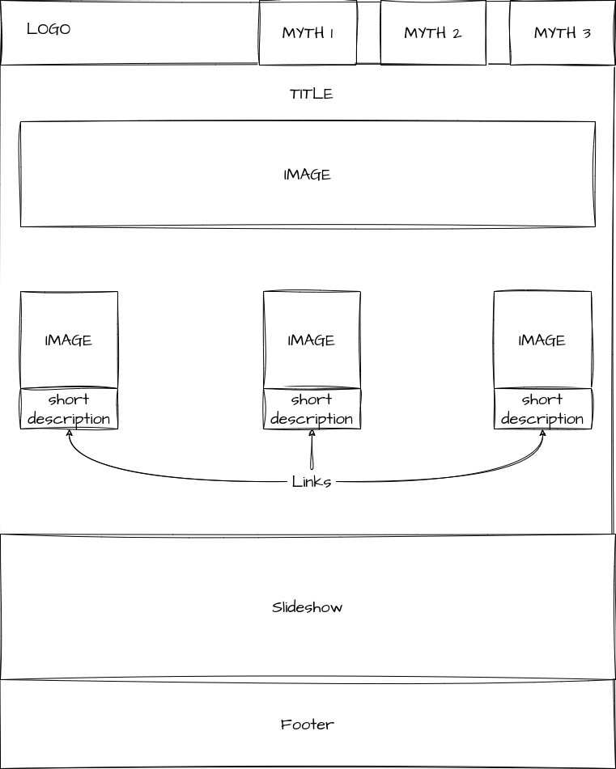
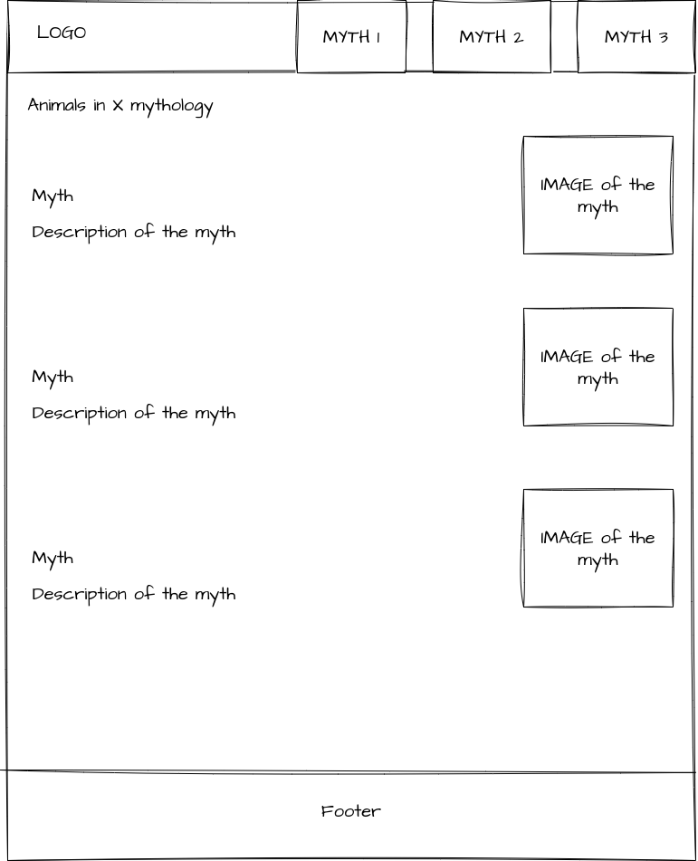
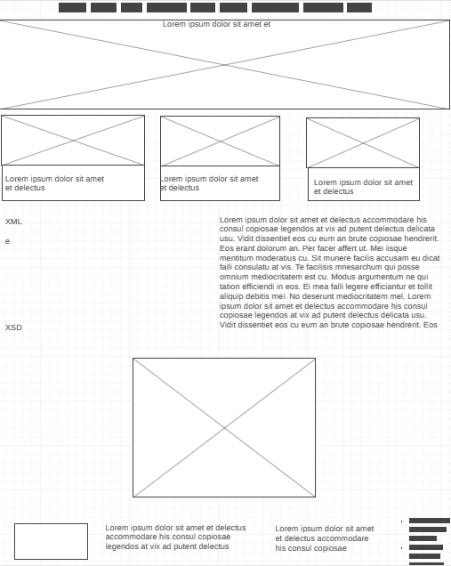
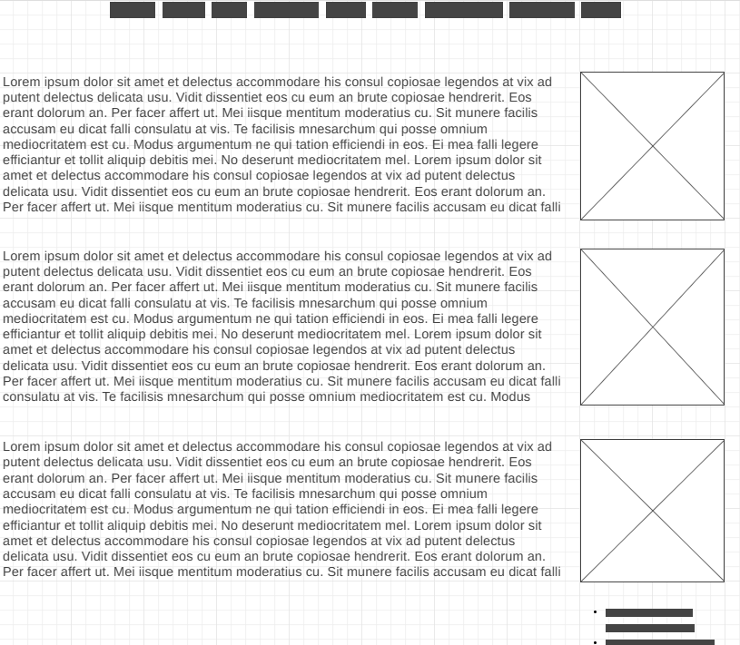
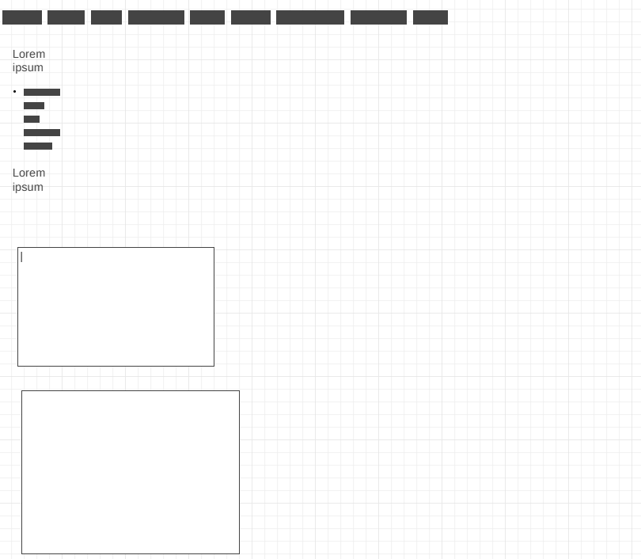
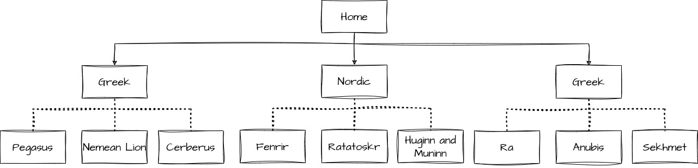

# C2 : User Interface

Navigation is made through a home page that directs the user to the different pages. A navigation bar is always present in the header for ease of use. The website is completly mobile friendly and the pages react to the resolution of the user.

## Interface and Common features

### Sketchs

_Your sketch_

| | | |
:---: | :---: | :---: 
 |  | 
First prototype showing the myths page|  Home page prototype | Second version of the myths page

### Wireframes

_Your wireframes with a description_  

| | | |
:---: | :---: | :---: 
 |  |  
Wireframe of the home page | Wireframe of the myth page | Wireframe of the about us page

### Sitemap

  

Home
- Greek
	- Pegasus
	- Nemean Lion
	- Cerberus
- Norse
	- Fenrir
	- Ratatoskr
	- Huginn and Muninn
- Egyptian
	- Anubis
	- Ra
	- Sekhmet
- About Us

---
[< Previous](c1.md) | [^ Main](../../../) | [Next >](c3.md)
:--- | :---: | ---: 
